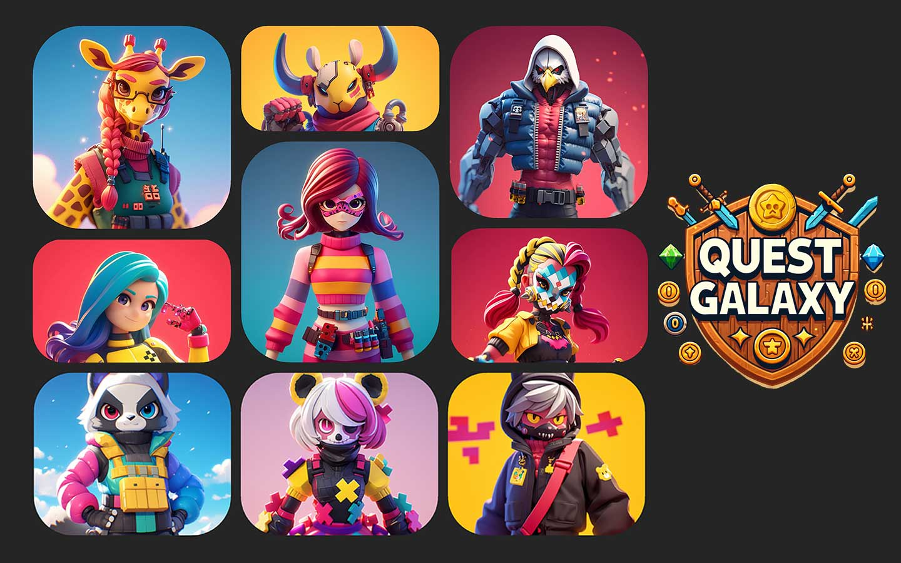

# CoinCollect Games

CoinCollect Games bring Web3 rewards into gameplay through our partnership with QuestGalaxy: https://questgalaxy.com/

<figure><figcaption>
QuestGalaxy Web3 Game Studio
</figcaption></figure>

## What is QuestGalaxy?

QuestGalaxy is a Web3 game studio creating blockchain-based gaming experiences that focus on:

- True asset ownership through NFTs and tokens
- Community-first design and participation
- Gameplay that stands on its own (not just token incentives)

### Why Web3 Gaming Matters

Traditional gaming locks achievements and rewards inside closed platforms. With Web3, players gain real ownership—unlocking NFTs, tradable tokens, and decentralized governance. In CoinCollect Games, your progress turns into real assets and new opportunities.

### CoinCollect: The Rewards Engine

- Stake NFTs in pools to earn tokens
- Claim rewards via your dashboard
- Track assets across multiple chains

### QuestGalaxy: Building Fun + Growth

QuestGalaxy (https://questgalaxy.com) builds Web3-native games with quests, leaderboards, competitions, and NFT-gated challenges, with a strong focus on community participation and gameplay quality.

### The Partnership: Games Powered by Rewards

- **NFT-gated games:** KEY NFTs and partner NFTs unlock access
- **Play-to-earn:** Earn $COLLECT, QuestGalaxy tokens, and special NFTs
- **Milestone achievements:** Progress generates collectible, tradable checkpoints
- **Seasonal events:** Leaderboards, exclusive loot, and bigger rewards

### What's In It For Players?

- Immersive gameplay and exclusive NFT access
- Earn $COLLECT, QuestGalaxy tokens, and limited-edition NFTs
- Special access using KEY NFTs and partner NFTs
- Connected multi-chain economy

## Featured game: GhostAlien

GhostAlien is QuestGalaxy’s invite-only space shooter built on Polygon, designed around sustainable Play-to-Earn tokenomics and NFT-gated gameplay.


[ghostalien.md](coincollect-games/ghostalien.md)


## Other QuestGalaxy games

QuestGalaxy also highlights additional games in its studio portfolio (availability may vary):

- Metaverse Explorers (open-world adventure)
- Token Racers (racing)

## Getting Started

1. Connect your wallet to CoinCollect.
2. Use a KEY NFT (or eligible NFT) to unlock games.
3. Play games on QuestGalaxy.
4. Claim rewards directly on CoinCollect's dashboard.

**Quick Links:**

- CoinCollect Games page in the app: https://app.coincollect.org/games
- Mint your KEY: https://opensea.io/collection/key2web3
- Stake your NFTs: https://app.coincollect.org/nftpools
- Claim rewards: https://app.coincollect.org/claim
- QuestGalaxy community: https://discord.gg/questgalaxy

### Looking Ahead

The partnership expands game mechanics, multi-chain accessibility, and seasonal events. Community governance will shape the ecosystem's future.

**Read the full blog post:** https://medium.com/coincollectapp/coincollect-games-x-questgalaxy-unlocking-the-future-of-play-to-earn-22b9be8c37d3

CoinCollect Games: Own, earn, and belong in the Web3 universe!
