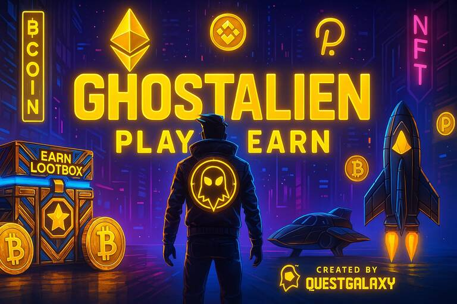

# GhostAlien (QuestGalaxy)

<figure><figcaption>
GhostAlien by QuestGalaxy
</figcaption></figure>


GhostAlien is QuestGalaxy’s invite-only space shooter built on Polygon, designed around sustainable reward pools and NFT-gated gameplay.




## At a glance

| Item | Details |
| --- | --- |
| Genre | Retro cyberpunk space shooter |
| Network | Polygon |
| Access | Invite-only + NFT-gated gameplay layers |
| Rewards | Coins/tokens, seasonal prizes, and NFTs (varies by season/pool) |

## Play

- Play now: https://ghostalien.questgalaxy.com/
- QuestGalaxy overview: https://questgalaxy.com/ghostalien.html
- CoinCollect Games in the app: https://app.coincollect.org/games

## Why GhostAlien is different

- Sustainable economy: rewards are designed to balance inflows and outflows for long-term stability
- Skill-based rewards: effort and engagement matter
- NFT integration: certain NFTs can unlock gameplay layers and reward multipliers
- Controlled access: invite-only approach helps protect the economy

## Game features

- Space combat with skill-based gameplay and competitive leaderboards
- Polygon integration for fast, low-cost transactions
- Structured reward pools with anti-inflation controls (burning, caps, dynamic adjustments)
- Seasonal competitions with prizes that may include rare NFTs and $COLLECT for top performers

## How this connects to CoinCollect

Depending on the season and pool configuration, CoinCollect can be used to:

- Stake eligible NFTs in pools: https://app.coincollect.org/nftpools
- Claim rewards: https://app.coincollect.org/claim

## NFTs and access keys

GhostAlien highlights several NFTs as access keys and reward multipliers:

- Key NFT: https://key2web3.com/ (also listed on OpenSea: https://opensea.io/collection/key2web3)
- Cyberpunk Citizenship NFT: https://opensea.io/collection/cyberpunk-citizenship/overview
- QuestGalaxy LootBox NFT: https://opensea.io/collection/questgalaxy-lootbox/overview


Always confirm the correct contract addresses and official links before minting or interacting with NFTs. Use [Official Accounts](../extras/offical-accounts.md) for verified channels.


## Need help?

- QuestGalaxy Discord: https://discord.gg/questgalaxy
- QuestGalaxy Twitter: https://twitter.com/questgalaxycom
- QuestGalaxy Telegram: https://t.me/questgalaxy
