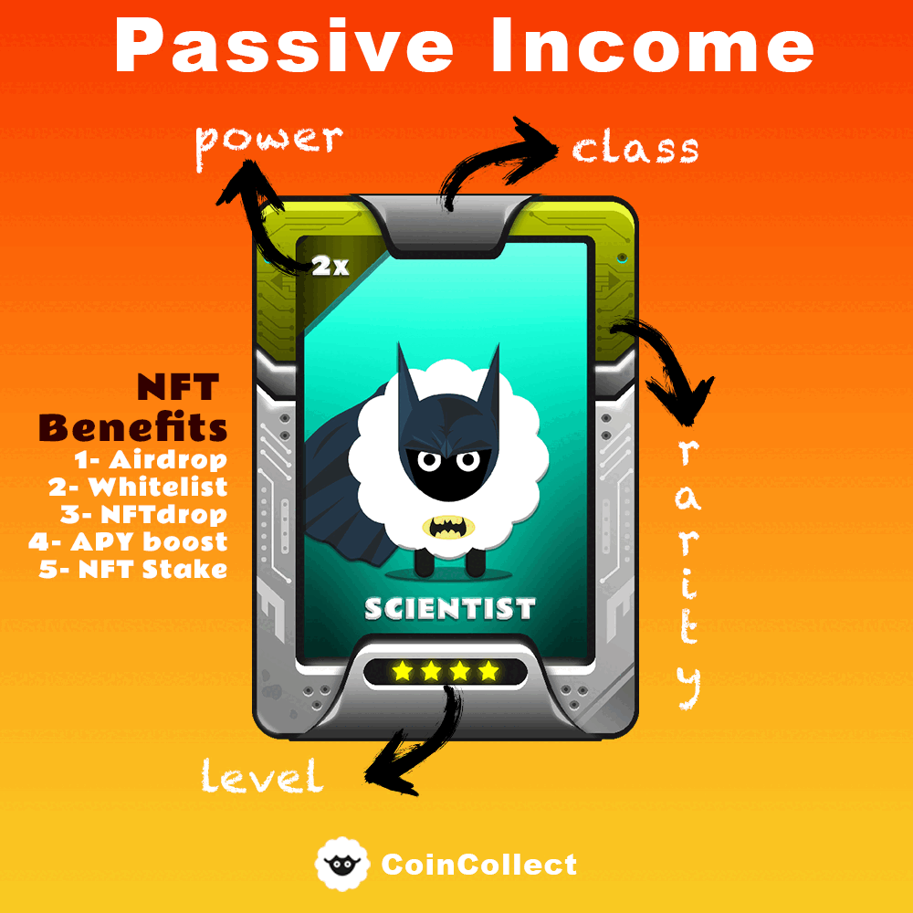
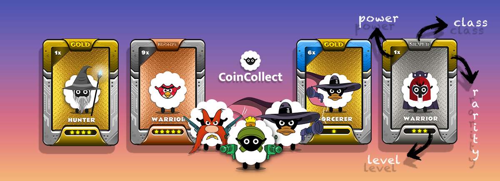

# Benefits of CoinCollect NFTs

<figure><figcaption>
passive income with CoinCollect NFTs
</figcaption></figure>

CoinCollect NFTs offer several benefits to their holders. First and foremost, they provide a unique ownership experience, as each NFT is one-of-a-kind and cannot be replicated. Additionally, they offer various utility functions, such as the ability to earn new coins passively, stake, farm, and trade on the platform and other platforms that support them.

Each NFT has a power attribute that determines its ability to generate coins or other benefits, with higher-powered NFTs providing greater rewards. The level attribute of each NFT also plays a role in determining its value, with higher-level NFTs generally being more rare and valuable.

CoinCollect NFTs can also be used to access exclusive content and features on the platform, and they offer a flexible ownership experience that allows holders to use, trade, or stake their NFTs as they please. In summary, CoinCollect NFTs offer a unique and valuable ownership experience with various benefits and utility functions.


### Here are some benefits of your NFTs

1. HOLD : Airdrop coins, NFTdrops, Giveaways, Whitelists and more...
2. STAKE : Boost APY, No impermenant loss
3. TRADE/SELL : Trade or sell on supported MarketPlaces such as OpenSea, NFTrade and more ...


<figure><figcaption>
CoinCollect Benefits
</figcaption></figure>
