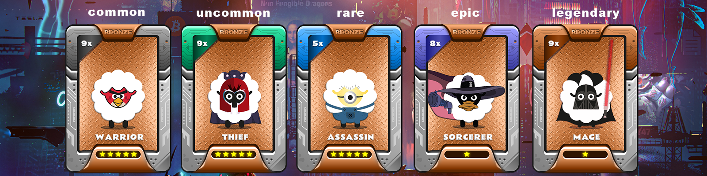
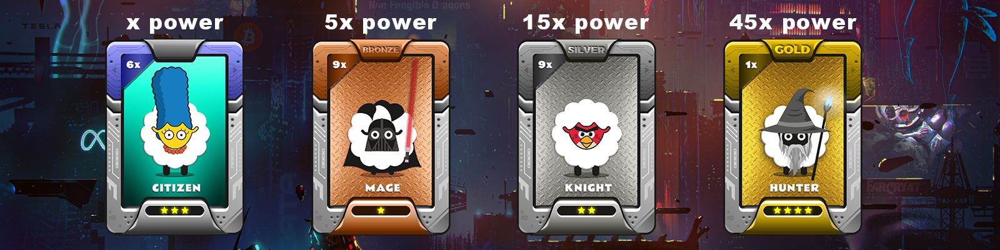
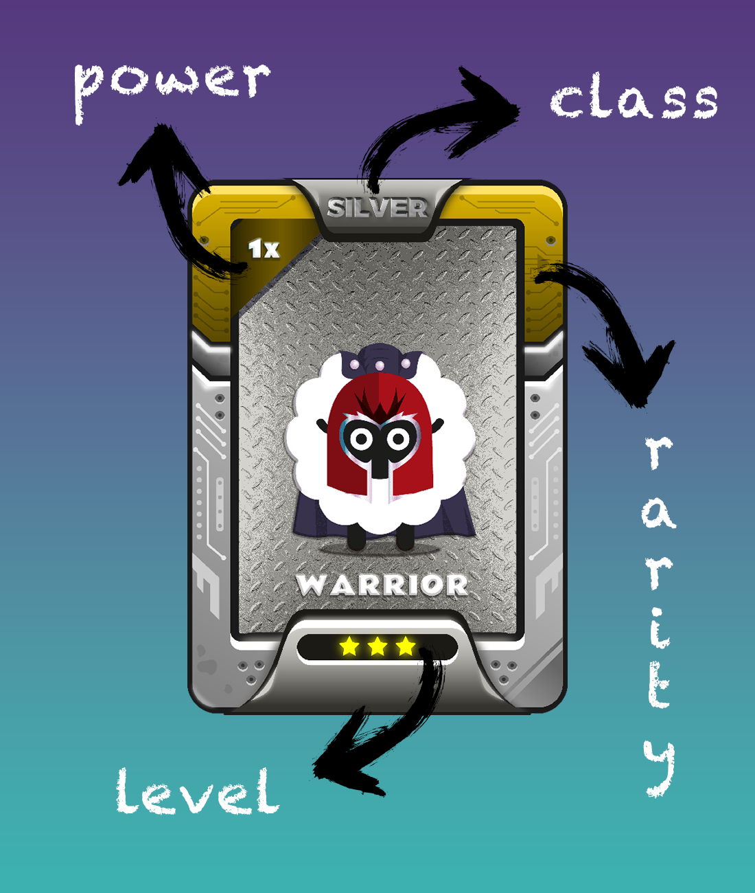

# How CoinCollect NFTs work?


**Good to know:** All CoinCollect NFTs has its own unique characteristics and power


## How NFT powers work?

NFTs have two attributes that help determine their power: Power and Level (Star). Power is represented by a number that is multiplied by a factor of 1x to 9x, which is displayed in the upper left corner of the NFT. The Level or Star rating of the NFT is indicated by a star rating of 1 to 5 stars, which is displayed at the bottom of the NFT. In addition, each NFT is classified as either a Starter (x), Bronze (5x), Silver (15x), or Gold (45x), which determines its base power multiplier. By multiplying the Power and Level attributes with the base multiplier of the NFT class, the total power of the NFT can be calculated.

**Each CoinCollect NFTs has 2 attributes that helps you calculate the power of your NFT**

* Power : on the upper left corner  a number times (1x-9x)
* Level(star): at the bottom of the your NFT (1star-5star)
* Class : Starter(x) - Bronze(5x) - Silver(15x) - Gold(45x)&#x20;

| STARTER NFT | 10                   | 20                   | 30                   | 40                   | 50                   |
| ----------- | -------------------- | -------------------- | -------------------- | -------------------- | -------------------- |
| Power (X)   | Level 1 (1 star NFT) | Level 2 (2 star NFT) | Level 3 (3 star NFT) | Level 4 (4 star NFT) | Level 5 (5 star NFT) |
|             | Hash Power           | Hash Power           | Hash Power           | Hash Power           | Hash Power           |
| 1x          | 10                   | 40                   | 90                   | 160                  | 250                  |
| 2x          | 20                   | 80                   | 180                  | 320                  | 500                  |
| 3x          | 30                   | 120                  | 270                  | 480                  | 750                  |
| 4x          | 40                   | 160                  | 360                  | 640                  | 1000                 |
| 5x          | 50                   | 200                  | 450                  | 800                  | 1250                 |
| 6x          | 60                   | 240                  | 540                  | 960                  | 1500                 |
| 7x          | 70                   | 280                  | 630                  | 1120                 | 1750                 |
| 8x          | 80                   | 320                  | 720                  | 1280                 | 2000                 |
| 9x          | 90                   | 360                  | 810                  | 1440                 | 2250                 |

