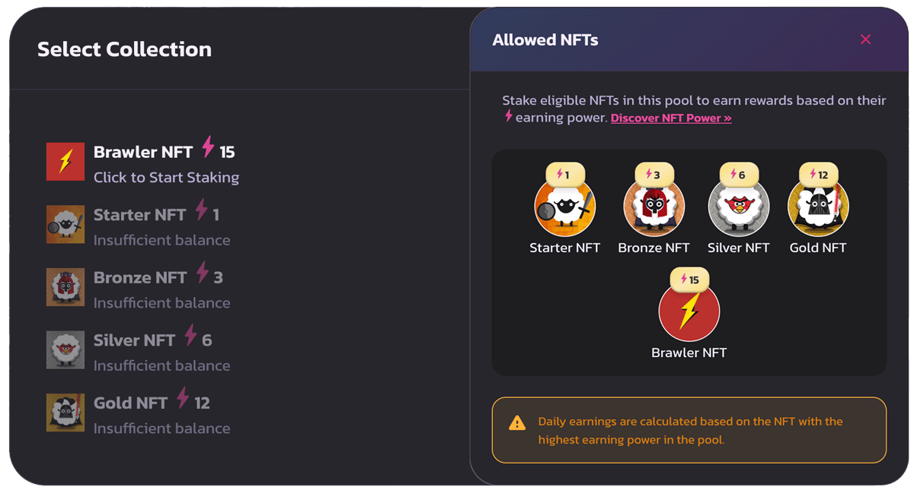

# ⚡ NFT Powers

### **⚡ NFT Power:  Higher power means higher earnings when staked.**

## Understanding NFT Power in Our Staking System

In the world of NFTs and decentralized finance, understanding the intricacies of how your digital assets can work for you is crucial. One of the key concepts in our staking system is the power of your NFTs, symbolized by the lightning icon (⚡). Let’s dive deeper into what this means and how it can benefit you.

***

## **What is NFT Power?**

NFT Power, denoted by the red ⚡ icon, is a measure of the earning potential of your NFT when you stake it in our platform. Think of it as a way to gauge the strength and productivity of your digital asset. The higher the power, the greater the rewards you can earn.

***

<figure><figcaption></figcaption></figure>

## **How Does NFT Power Work?**

When you stake your NFT, its power determines the amount of rewards you will receive. You can also stake more than one NFT in each pool, meaning the total power is the sum of the powers of all staked NFTs. For example, if you stake three NFTs with powers of 5, 10, and 15, your total earning power will be 30.

<figure><figcaption>
<strong>CoinCollect NFT Powers</strong>
</figcaption></figure>

Here’s a breakdown example of some individual NFT powers:  Brawler NFT is an example for Partner NFT pool

* **Brawler NFT ⚡ Power: 15**
  * As a high-powered NFT, the Brawler NFT is among the top earners. Staking this NFT will yield substantial rewards, making it a valuable asset in your collection.
* **Starter NFT ⚡ Power: 1**
  * This entry-level NFT has the lowest power, earning modest rewards. It’s perfect for beginners just getting started in the NFT space.
* **Bronze NFT ⚡ Power: 3**
  * With slightly more power, the Bronze NFT offers better rewards than the Starter NFT, making it a good middle-ground choice.
* **Silver NFT ⚡ Power: 6**
  * The Silver NFT provides a balance between accessibility and earning potential, offering decent rewards for a reasonable investment.
* **Gold NFT ⚡ Power: 12**
  * Just below the Brawler NFT, the Gold NFT is a powerful asset that offers significant rewards, ideal for serious collectors and investors.

***

## **Why Does NFT Power Matter?**

NFT Power is essential because it directly influences your earnings in our staking system. By understanding and leveraging this power, you can maximize your returns and make informed decisions about which NFTs to stake.

* **Maximize Earnings**: Higher-powered NFTs yield more rewards, allowing you to earn more tokens, NFTs, and other gifts.
* **Stake Multiple NFTs**: You can stake more than one NFT in each pool. The total power is the sum of the powers of all staked NFTs, further boosting your earning potential.
* **Strategic Staking**: Knowing the power of your NFTs helps you plan your staking strategy effectively, ensuring you get the best possible returns.
* **Enhanced Engagement**: Engaging with higher-powered NFTs keeps you more involved in the platform, offering a more rewarding experience.

***

<figure><figcaption></figcaption></figure>

## **How to Check Your NFT Power**

In your collection, each NFT will display a red ⚡ icon followed by a number indicating its power. Here’s what it looks like in your staking interface:

#### Select Collection

* **Brawler NFT** ⚡ **Power: 15** \[Click to Start Staking]
* **Starter NFT** ⚡ **Power: 1** \[Insufficient Balance]
* **Bronze NFT** ⚡ **Power: 3** \[Insufficient Balance]
* **Silver NFT** ⚡ **Power: 6** \[Insufficient Balance]
* **Gold NFT** ⚡ **Power: 12** \[Insufficient Balance]

***

By keeping an eye on the red ⚡ icon and its accompanying number, you can easily assess the earning potential of each NFT in your collection. Higher numbers mean more power and, consequently, higher rewards when you stake your NFT.

## Conclusion

Understanding and utilizing NFT Power is a game-changer in maximizing your earnings on our platform. Keep track of the red ⚡ icon, strategize your staking, and watch your rewards grow. Happy staking!

***

By following this guide, you’ll be well on your way to becoming a proficient NFT staker, making the most out of your digital assets. Remember, the power is in your hands!

<figure><figcaption></figcaption></figure>
