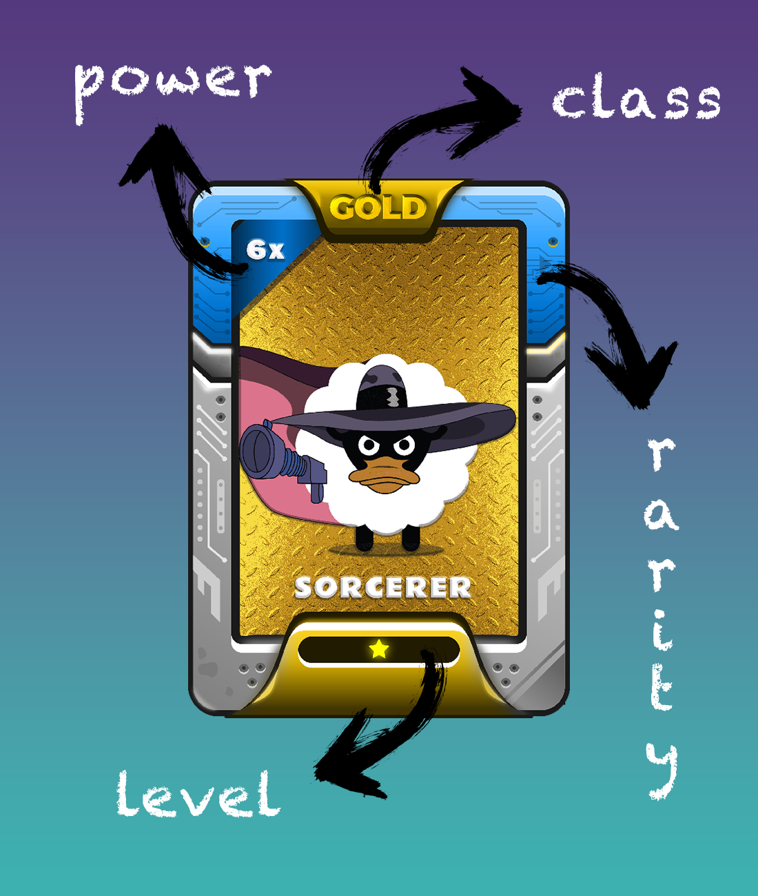

# What are CoinCollect utility NFTs?


**Good to know:** CoinCollect NFTs are unique and useful.&#x20;

Here are some benefits of CoinCollect NFTs

* HOLD : Airdrop coins, NFT drops, giveaways, whitelists, and more...
* STAKE : Boost APY, no impermanent loss
* TRADE/SELL : Trade or sell on supported marketplaces such as OpenSea, NFTrade, and more...


## CoinCollect utility NFTs

CoinCollect special utility NFTs are a unique class of non-fungible tokens that offer special benefits to their holders. These NFTs are valuable assets that can earn coins for their holders. They are unique and can't be replicated, meaning that they are one-of-a-kind and possess a certain level of rarity. These NFTs are minted on the CoinCollect platform, they can be used to mint new coins, stake, farm or trade on the platform and other platforms that support them.

One of the key benefits of CoinCollect special utility NFTs is that they can be used to earn new coins. For example, by holding a special utility NFT, a user may be able to earn a certain number of coins every day, or every week, or even every month. This allows holders of these NFTs to passively earn coins without having to actively trade or farm.

The NFTs are fully owned by the holder, meaning that they can trade, stake, farm or use them as they please. This allows for flexibility and control over the NFTs, making them a valuable addition to any NFT collection.

In summary, CoinCollect special utility NFTs are unique assets that offer additional benefits and utility to holders, such as earning new coins, staking, farming, trading and other possibilities in the future. These NFTs are valuable and can be used to earn coins passively, giving holders the flexibility to use them as they please.

