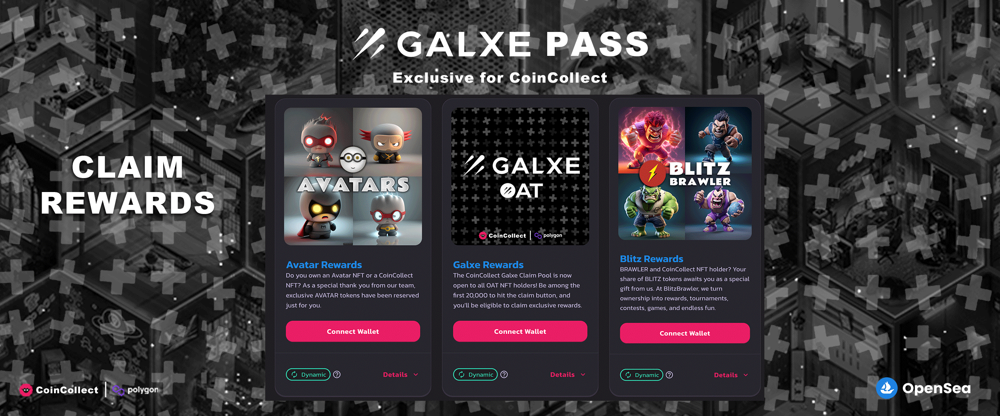
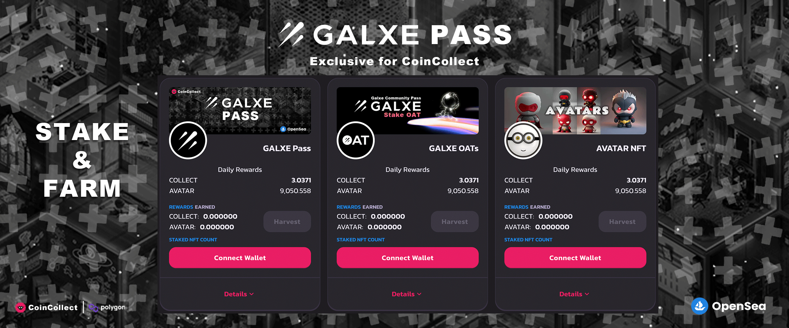

# Stake Galxe OAT NFT (Community Rewards)

## How to claim rewards and stake your OATs?

**CoinCollect is the platform where only the highest quality NFT projects make their debut. Every project launched within CoinCollect is accompanied by a unique stake and claim pool. This ensures that those who participate can claim rewards and stake NFTs for ongoing earnings.**

### CoinCollect proudly presents its own quartet of distinguished NFTs: Starter, Bronze, Silver, and Gold. Ownership of these NFTs can grant access to stake and claim pools within the CoinCollect ecosystem.

## OAT HOLDER!

<mark style="color:orange;">**Exclusive Opportunity for the First 10,000 OAT Holders! We're excited to meet new users and introduce them to our system. As a special incentive, we're offering this unique opportunity exclusively to the first 10,000 OAT holders. Follow the instructions below, and if you're an OAT holder, you can immediately claim your rewards from our exclusive claim pools and start staking your OATs in our stake pools, beginning your regular earnings journey right away!**</mark>

## How to claim your tokens (Galxe OAT)

## 1- Enter the "[Claim Rewards](https://app.coincollect.org/claim)" page.

## 2- Find the "Galxe OAT Claim pool" and click "Claim" to receive your reward.

<figure><figcaption></figcaption></figure>

## <mark style="color:red;">How to stake your Galxe OAT NFT</mark>&#x20;

## 1 - Enter the [NFT Stake](https://app.coincollect.org/nftpools) page.

## 2- Use the "Connect Wallet" button to log in.

## 3- Click on the "Click To Stake Now" button located over the OAT pool.

## 4- From the list of stakable collections, select **Galxe OATs**.

## 5- Choose the OAT(s) you wish to stake. Press "Stake" and monitor your earnings in real-time.

<figure><figcaption></figcaption></figure>

##
