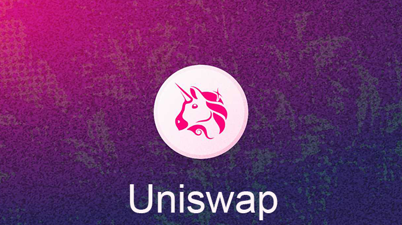

# Buy $COLLECT


The CoinCollect DeFi project presents the **$COLLECT** token, a core component of our innovative decentralized finance ecosystem. Learn about the token's utility and integration within the CoinCollect platform, as well as its availability for secure swapping on **UniSwap** and **QuickSwap**. This document offers an in-depth overview of the COLLECT token and its role in revolutionizing the DeFi landscape.

[offical-accounts.md](../extras/offical-accounts.md "mention")




<figure><figcaption></figcaption></figure>

1. just go to [CoinCollect](https://app.coincollect.org/) App and go to [Swap](https://app.coincollect.org/swap) Page.

### [https://app.coincollect.org/swap](https://app.coincollect.org/swap)



<figure><figcaption></figcaption></figure>

1. **Go to** [**QuickSwap**](https://quickswap.exchange/)
2. **Hit this link to add collect** [**https://quickswap.exchange/#/swap?outputCurrency=0x56633733fc8BAf9f730AD2b6b9956Ae22c6d4148**](https://quickswap.exchange/#/swap?outputCurrency=0x56633733fc8BAf9f730AD2b6b9956Ae22c6d4148\&swapIndex=0)
3. **or add collect token manually by adding the collect address : 0x56633733fc8BAf9f730AD2b6b9956Ae22c6d4148**



<figure><figcaption></figcaption></figure>

1. **Go to uniswap choose polygon network**
2. **Hit this link to add collect** [**https://app.uniswap.org/#/swap?outputCurrency=0x56633733fc8BAf9f730AD2b6b9956Ae22c6d4148**](https://app.uniswap.org/#/swap?outputCurrency=0x56633733fc8BAf9f730AD2b6b9956Ae22c6d4148)
3. **or add collect token manually by adding the collect address : 0x56633733fc8BAf9f730AD2b6b9956Ae22c6d4148**



